# BondoMan

Aplikasi manajemen keuangan dengan kemampuan menyimpan dan menampilkan detail transaksi, melihat grafik rangkuman, melakukan scan nota, dan export ke spreadsheet.

## Daftar Isi

1. [Fitur](#fitur)
2. [Library](#library)
3. [Screenshots](#screenshots)
4. [Analisis OWASP](#analisis-owasp)
5. [Accessibility Testing](#accessibility-testing)
4. [Pembagian Kerja](#pembagian-kerja)
7. [Waktu Pengerjaan](#waktu-pengerjaan)

## Fitur

- Menambah transaksi
- Melihat daftar transaksi
- Melihat detail transaksi (judul, tanggal, kategori, nominal, lokasi)
- Scan nota
- Mendapatkan lokasi secara otomatis
- Melihat grafik rangkuman
- Export data ke .xls dan .xlsx
- Mengirim email dengan data export
- Membuat transaksi random
- Mengambil foto twibbon
- Safe login dengan enkripsi token

## Library
#### Others
- Retrofit v2.9.0 \
  Untuk membuat dan mengirim http request
- Apache POI v4.0.0 \
  Untuk membuat file export berbentuk spreadsheet
- PhilJay/MpAndroidChart v3.1.0 \
  Untuk membuat graf rangkuman transaksi

#### UI
- Core KTX v1.12.0\
  Ekstensi kotlin untuk AndroidX library
- AppCompat v1.6.1
- Material Component v1.11.0
- ConstraintLayout v2.1.4, SwipeRefreshLayout v1.1.0
- CoreSplashScreen v1.1.0
- CameraX v1.3.2

#### Lifecycle
- Room v2.6.1 \
  Untuk menyambungkan dengan persistence layer
- LifeData, ViewModel v2.7.0
- Encrypted Shared Preferences v1.1.0-alpha06

## Screenshots
### Login
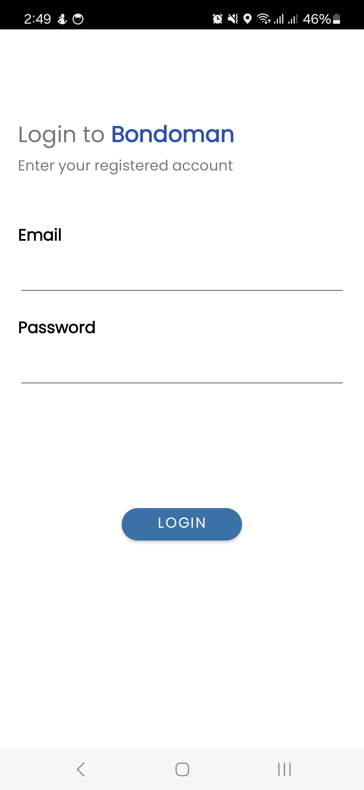
### Daftar transaksi
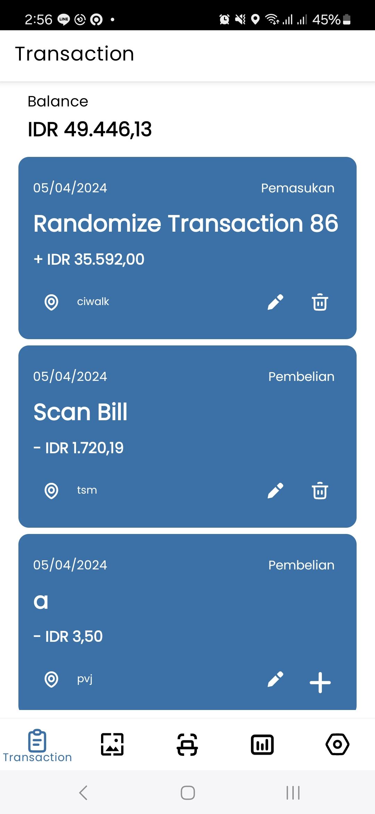
### Add/edit transaction
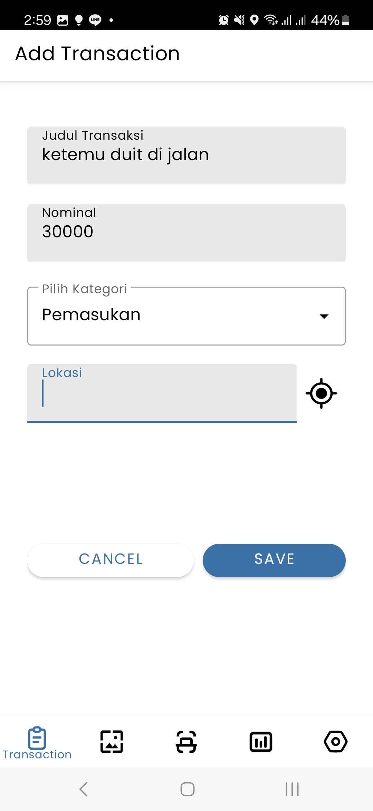
### Scan nota (galeri)
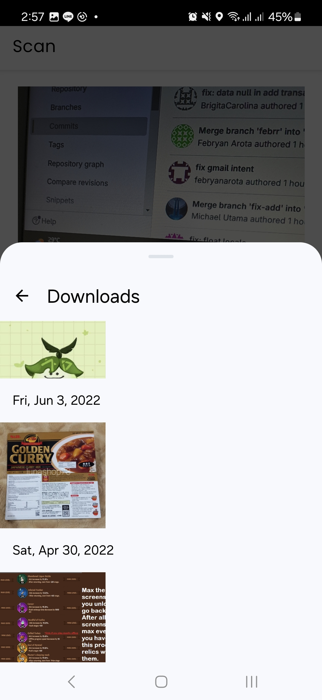
### Scan result
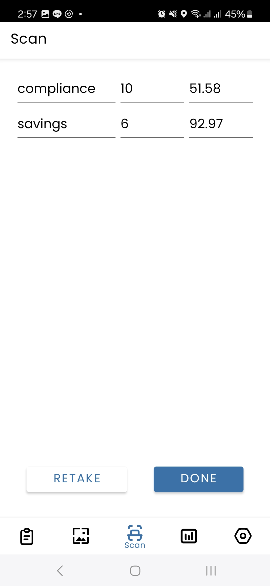
### Graf ringkasan (potrait)
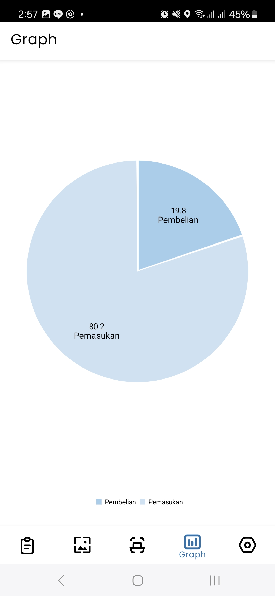
### Graf ringkasan (landscape)
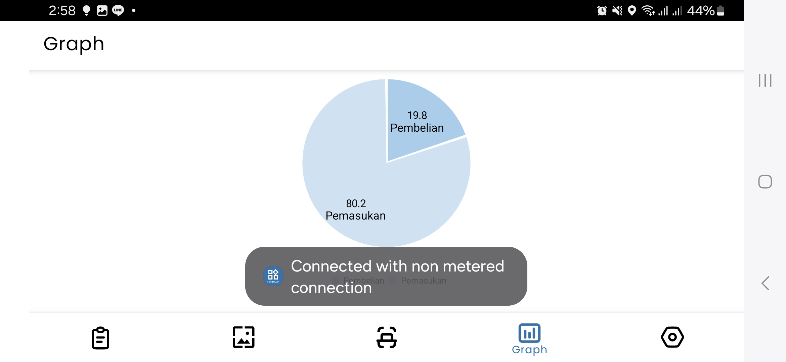
### Settings
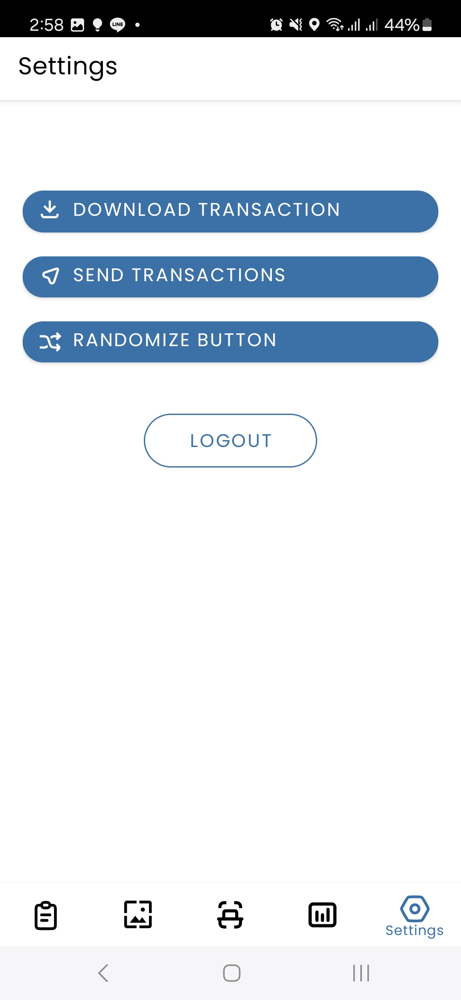
### XLS format
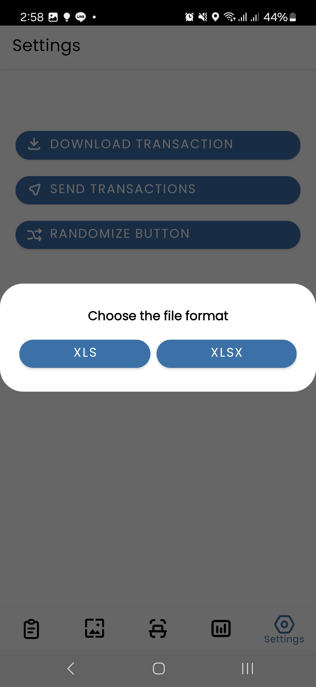
### Twibbon
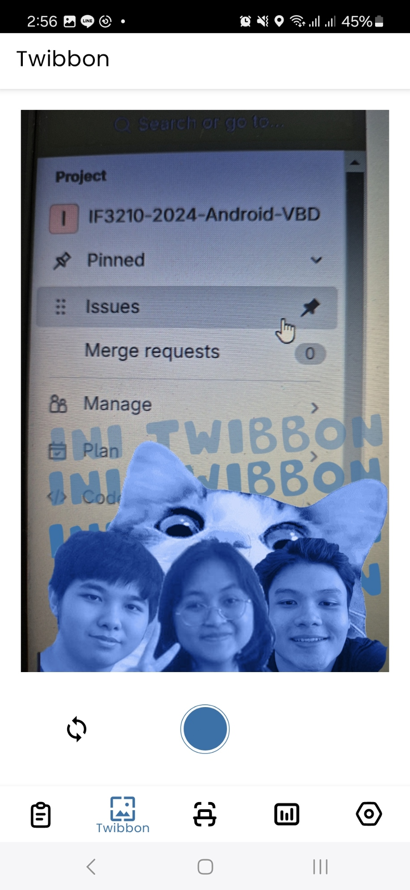

## Analisis OWASP
1. M4 - Insufficient Input/Output Validation \
  Terdapat beberapa bagian aplikasi yang memerlukan validasi input/output, yaitu:
    1. Login\
      Field data Email dan Password merupakan bagian yang mungkin memerlukan akses ke db menggunakan sql. Meskipun kewajiban untuk serangan serupa ada di backend (misal dengan parameterized query), dari sisi frontend dapat dilakukan pencegahan seperti encode karakter quote(')
    2. Add transaction\
      Form add/edit transaksi memiliki user input yang akan diterjemahkan ke angka (Float). Terdapat masalah jika menggunakan formatter secara langsung, karena mungkin terpengaruh locale masing-masing smartphone. 
      \
      \
      Masalah ini terasa pada edit form, terutama ketika format dari sistem mengikuti locale Indonesia (koma sebagai penanda desimal) namun smartphone mengikuti locale US (titik sebagai penanda desimal). Hal ini dapat membuat flow aplikasi terganggu.
2. M8 - Security Misconfiguration\
  Terdapat beberapa bagian aplikasi yang rentan terhadap security misconfiguration, yaitu:
    1. Broadcast Receiver (Random)\
      Fungsi randomize yang diterima dengan broadcast receiver seharusnya memiliki flag `Context.RECEIVER_NOT_EXPORTED`, karena hanya perlu diakses oleh fragment setting (yang terikat pada main activity).
      \
      \
      Namun, ketika dilakukan pengujian, receiver tidak dapat menerima broadcast pada smartphone tertentu (terutama yang memiliki API Level 34). Untuk itu, perlu dilakukan pengubahan flag menjadi `Context.RECEIVER_EXPORTED` agar dapat digunakan di seluruh smartphone uji.
      \
      \
      Hal tersebut tidak aman karena menyebabkan receiver dapat diakses dari aplikasi lain yang mungkin menambahkan transaksi yang tidak diinginkan. Untuk mengatasinya, kami mencari informasi tentang perubahan di android 14 dan menemukan [issue ini](https://issuetracker.google.com/issues/293487554?pli=1).
      \
      \
      Mengacu pada issue di atas, flag dapat dikembalikan dan tetap berjalan di Android 14.

3. M9 - Insecure Data Storage\
  Terdapat bagian aplikasi yang sangat memerlukan data storage aman, seperti:
    1. Token manager\
      Token yang didapat dari backend harus disimpan dengan aman. Untuk itu, kami menggunakan encrypted shared preferences agar token tersebut tidak tersimpan plaintext. Kunci yang digunakan adalah AES-256, yang cukup kuat untuk standar sekarang. 

## Accessibility Testing
Accessibility Testing dilakukan dengan menggunakan aplikasi Accessibility Scanner yang terdapat pada playstore. Dengan membuka aplikasi BondoMan dan menggunakan tools screen record pada accessibility scanner kemudian melakukan tour pada aplikasi, maka accessibility scanner akan mengusulkan beberapa perbaikan akan aksesibilitas. Berikut adalah beberapa suggestion sebelum dilakukan perbaikan aksesibilitas pada aplikasi. 

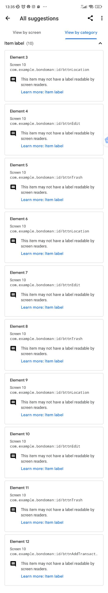
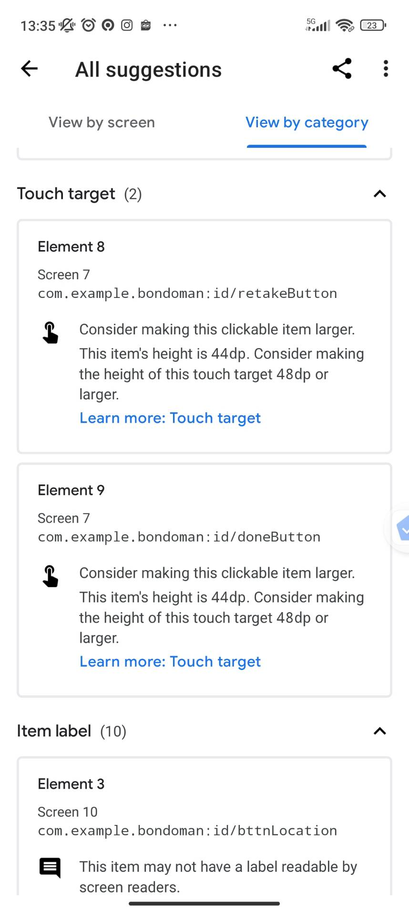
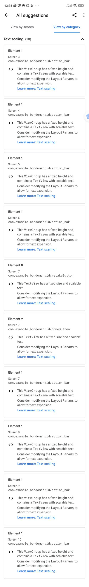
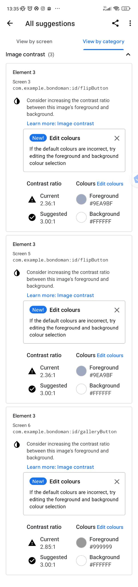
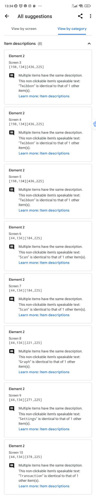
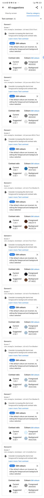

Setelah dilakukan beberapa perbaikan, berikut adalah hasil akhir accessibility testing.
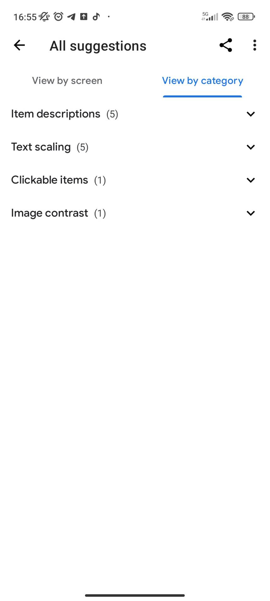

Beberapa perbaikan pada item description dan text scaling tidak dapat dilakukan, karena perbaikan yang perlu dilakukan adalah mengubah item description pada action bar dan bottom navbar, di mana item description pada kedua bagian tersebut pasti sama. Selain itu, text scaling disebabkan oleh fixed height yang merupakan bawaan dari action bar library navigation. 

## Pembagian Kerja
- 13521120 Febryan Arota Hia
    - xls export
    - Email
    - Login
    - Token service
    - Splash screen
    - Twibbon
- 13521137 Michael Utama
    - Scan nota
    - Location
    - Network sensing
    - OWASP
- 13521156 Brigita Tri Carolina
    - Navbar
    - Add & edit transaction
    - View transaction list
    - Graf rangkuman
    - Randomize
    - Accessibility Testing

## Waktu pengerjaan
- 13521120 Febryan Arota Hia\
  10 jam persiapan, 40 jam pengerjaan
- 13521137 Michael Utama\
  10 jam persiapan, 35 jam pengerjaan
- 13521156 Brigita Tri Carolina\
  10 jam persiapan, 40 jam pengerjaan
